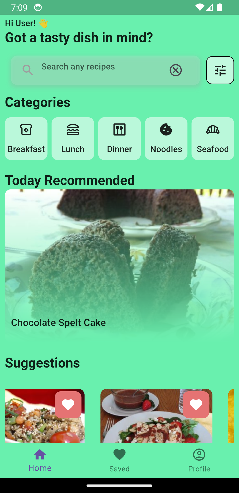
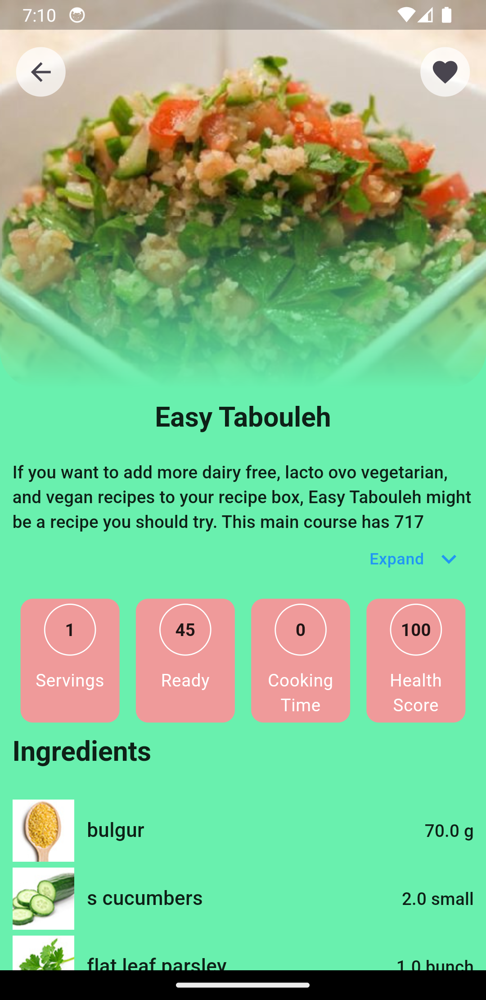

# food_recipe_app

A Flutter app showing meal recipe and recommend healthy food using Spoonacular API.

## Features: 
    - Riverpod state management.
    - Hive for local storage.
    - Firebase Authentication.
 

  
  
  
</>

## Todos:
    - Add Firebase Firestore for user-specific recipes collection.
    

## Getting Started
    0. First get your Spoonacular API key at https://spoonacular.com/food-api/.
    1. Clone the repository.
    2. Navigate to the project directory.
    3. Run flutter pub get to fetch the dependencies.
    4. Open the project in your preferred Flutter IDE.
    5. Run the app on your desired emulator or physical device.
