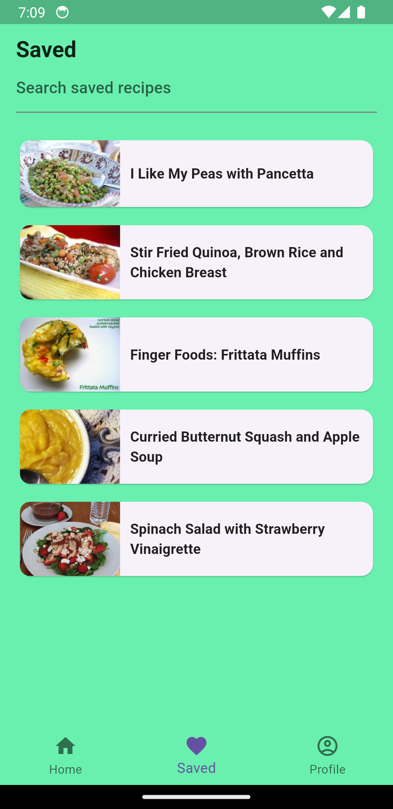

# food_recipe_app

A Flutter app showing meal recipe and recommend healthy food using Spoonacular API.

Features: Riverpod state management, Hive for local storage.
 

  
  
</>

Todos:
- Add custom theme.
- Elaborate recipe screen.
- Add feature-rich func.

## Getting Started

This project is a starting point for a Flutter application.

A few resources to get you started if this is your first Flutter project:

- [Lab: Write your first Flutter app](https://docs.flutter.dev/get-started/codelab)
- [Cookbook: Useful Flutter samples](https://docs.flutter.dev/cookbook)

For help getting started with Flutter development, view the
[online documentation](https://docs.flutter.dev/), which offers tutorials,
samples, guidance on mobile development, and a full API reference.
